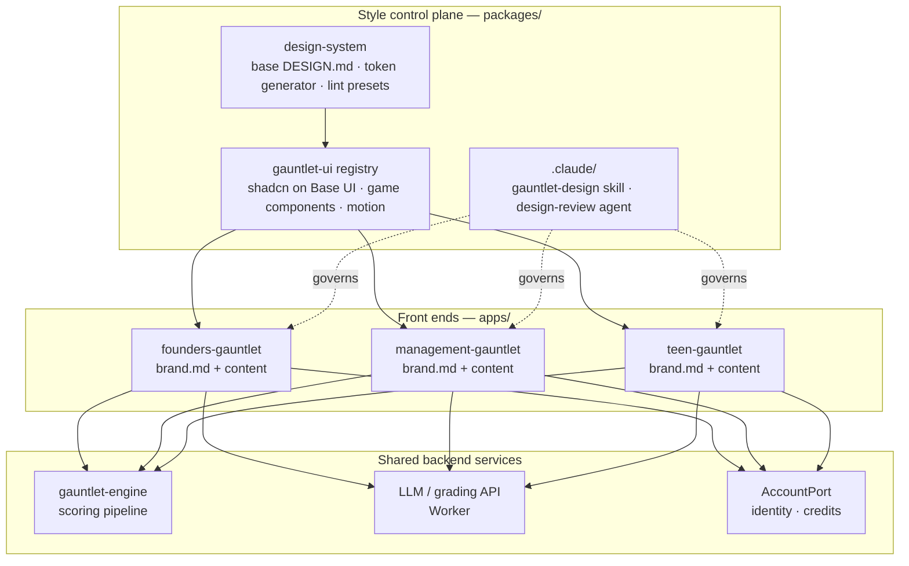

# 09 — The Style Control Plane (one monorepo, many front ends)

## Bottom line

One monorepo holds **N separate branded front ends** (one per audience) plus **shared
backend services**. A single **style control plane** makes each front end consistent
end to end and prevents slop patterns everywhere. Each gauntlet
supplies only its `brand.md` and content. The control plane supplies everything else
and enforces it in CI, the same way for every app.

## Shape

## What the control plane owns

| Package | Owns | Apps may... |
|---|---|---|
| `packages/design-system` | Base `DESIGN.md`, the token generator (brand.md → `@theme` CSS + TS skin), the shared ESLint/Stylelint/Playwright presets | Supply a `brand.md`, nothing else |
| `packages/gauntlet-ui` | The shadcn registry (Base UI primitives + our styled components), game components, the motion moment catalog | Import and compose; **never fork or restyle** (lint `no-restyle`) |
| `.claude/` (repo root) | The `gauntlet-design` skill, the `design-review` agent, `/design-review`, the CLAUDE.md pointers | Nothing app-specific |

## What each front end owns

- `brand.md` (identity, [02](02-brand-md.md))
- content modules (the gauntlet contract items 1–4, `ARCHITECTURE.md` §4)
- `wiring.ts` (the composition root)
- its own deploy target and domain

That's all. A front end has **no hand-written CSS, no local component variants, and
no local lint overrides.**

## How consistency is enforced across apps

- **Shared presets, not copies.** Each app's `eslint.config` / `playwright.config`
  only *extends* the control-plane preset, and CI fails if an app overrides a design rule.
- **CI matrix over all apps × brands × themes × widths.** A change to `gauntlet-ui`
  is screenshot-tested against *every* gauntlet before merging. One PR can't
  fix Founder's and quietly break Teen.
- **The specimen page per brand** ([08](08-claude-workflow.md) step 4) is a
  permanent route in every app and is part of the baselines, so brand drift shows up
  at a glance.
- **Affected-only builds** (Turborepo or Nx) keep the matrix fast: a change to one
  app's `brand.md` tests only that app, while a change to the registry tests all of them.

## Shared backend

Front ends share the engine, the LLM/grading Worker and `AccountPort`. This matches
`ARCHITECTURE.md` §6 and §8. The open question from ARCHITECTURE §10 applies here: **one shared
Worker/API for all brands, or one per brand?** The control-plane model favors a shared
API layer, with the brand passed as a request parameter, because it keeps the front ends
thin and identical in shape.

## ⚠️ Changes this implies for ARCHITECTURE.md

1. **The engine moves into this monorepo** (or is vendored by CI). "Everything managed
   here in one big monorepo" resolves the §3 cross-repo `file:` deploy risk by
   removing the cross-repo dependency.
2. **§5's "no visual redesign" non-goal is superseded** by the control plane.
3. **The new `packages/design-system`** sits beside `gauntlet-ui` in the §3 layout.

These need a decision before ARCHITECTURE.md is revised.

Resolved in `ARCHITECTURE.md` v3: the engine is ported into this repo (no vendoring, no cross-repo dependency), and `packages/design-system` sits beside `gauntlet-ui`.
