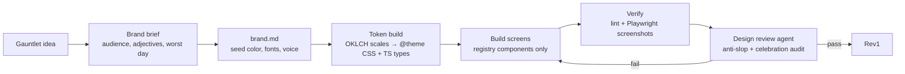

# Best Practices — Design Pipeline for Claude-Built Gauntlets

Status: RESEARCH — compiled 2026-09-25. No code yet. These docs are the standard every
gauntlet's UI is built against; once adopted, the rules here become `DESIGN.md`, a
`gauntlet-design` skill, and CI lint config.

**Short version + execution checklist: [KICKSTART.md](KICKSTART.md)**: one input
(brand file), one kit (shared UI), three gates (lint, screenshots, review).

## Bottom line

Polish is only reliable when three layers work together. Each layer below links to the
doc that covers it.

1. **Intent (what it should look like and why):** a shared base `DESIGN.md` plus one
   `brand.md` per gauntlet. See [01](01-design-md.md) and [02](02-brand-md.md).
2. **Constraint (make the wrong thing hard):** typed tokens, a curated component
   registry, and motion primitives. See [03](03-tokens-and-typescript.md),
   [04](04-component-systems.md) and [05](05-motion-and-celebration.md).
3. **Enforcement (reject drift automatically):** lint, screenshot baselines, and a
   design-review agent. See [07](07-guardrails-and-verification.md).

Taste rules that no linter can check live in [06-anti-slop](06-anti-slop.md). How
Claude runs the whole thing, idea to Rev1, is in [08-claude-workflow](08-claude-workflow.md).

## The pipeline (idea to Rev1)

Only step B→C is creative work per gauntlet. Everything from D onward is shared and
mechanical, so every new gauntlet reaches the same finish without anyone redoing polish work.

## Files

| # | Doc | Answers |
|---|---|---|
| 01 | [design-md](01-design-md.md) | What goes in the shared base `DESIGN.md` |
| 02 | [brand-md](02-brand-md.md) | What a single gauntlet authors to get its own brand |
| 03 | [tokens-and-typescript](03-tokens-and-typescript.md) | Tailwind v4 tokens, OKLCH scales, typed skin + variants |
| 04 | [component-systems](04-component-systems.md) | Which UI system (research + recommendation) |
| 05 | [motion-and-celebration](05-motion-and-celebration.md) | How to celebrate progress through the flow without clutter |
| 06 | [anti-slop](06-anti-slop.md) | The banned-pattern list and the required choices |
| 07 | [guardrails-and-verification](07-guardrails-and-verification.md) | Lint rules, screenshot tests, review agent |
| 08 | [claude-workflow](08-claude-workflow.md) | Skills, rules and the order Claude works in |
| 09 | [control-plane-monorepo](09-control-plane-monorepo.md) | One monorepo, N branded front ends, shared backend, one style control plane |
| — | [SOURCES](SOURCES.md) | All research citations |

## Relation to ARCHITECTURE.md

This work extends contract item 5 (visual skin, `ARCHITECTURE.md` §4) from "palette +
logo + copy" to a full `brand.md`. It supersedes §5's "no visual redesign" non-goal, and
the single-monorepo direction resolves §3's cross-repo deploy risk. See
[09](09-control-plane-monorepo.md#️-changes-this-implies-for-architecturemd).
